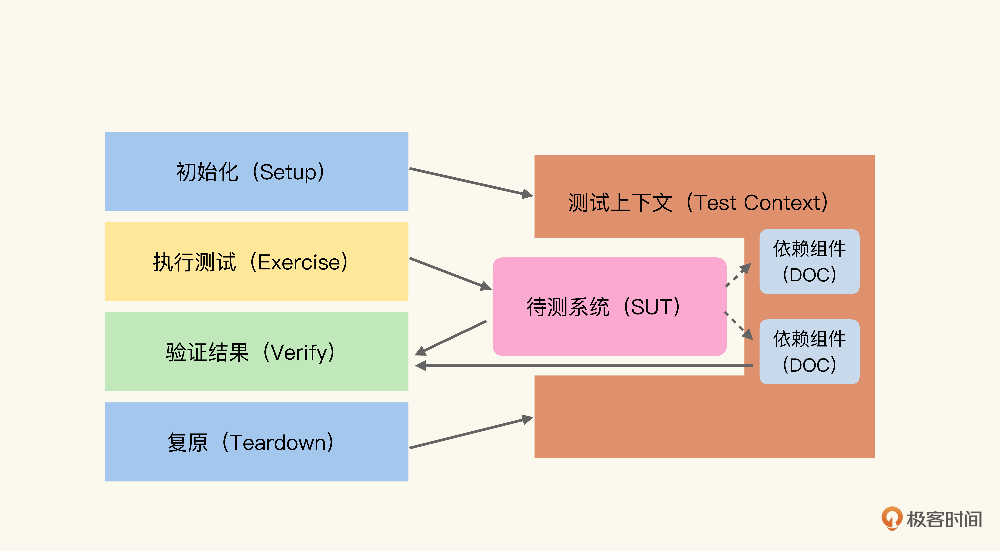
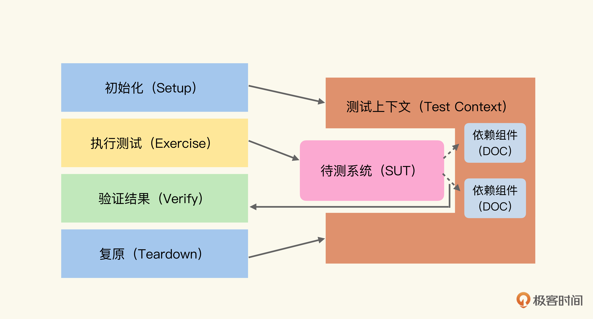

  
# [徐昊 · TDD 项目实战 70 讲](https://time.geekbang.org/column/intro/100109401?tab=catalog)

## WIP

### 实战项目一｜命令行参数解析 (11讲)

- 01｜TDD演示（1）：任务分解法与整体工作流程
- 02｜TDD演示（2）：识别坏味道与代码重构
- 03｜TDD演示（3）：按测试策略重组测试
- 04｜TDD演示（4）：实现对于列表参数的支持
- 05｜TDD中的测试（1）：状态验证为什么是主要的使用方式？
- 06｜TDD中的测试（2）：行为验证为什么应该尽量避免使用？
- 07｜TDD中的测试（3）：集成测试还是单元测试？

---

## 笔记

### 测试的基本结构

- 初始化：主要是设置测试上下文，从而使待测系统（System Under Test）处于可测试的状态。例如，对于需要操作数据库的后台系统，测试上下文包含了已经灌注测试数据的测试用数据库，并将其与待测系统连接。
- 执行测试：就是按照测试脚本的描述与待测系统互动。例如，按照功能描述，通过 API 对系统进行相应的操作。
- 验证结果：就是验证待测系统是否处于我们期待的状态中。例如，经过测试，数据库中的业务数据是否发生了期待中的改变。
  - 状态验证（State Verification）：是指在与待测系统交互后，通过比对测试上下文与待测系统的状态变化，判断待测系统是否满足需求的验证方式。是一种黑盒验证。它将测试上下文与待测系统当作一个整体。是主要的使用方式。
  - 增量状态验证（Delta Verification）：
  - 行为验证（Behavior Verification）：行为验证背后的逻辑是，状态的改变是由交互引起的。如果所有的交互都正确，那么就可以推断最终的状态也不会错。是一种白盒验证。旨在降低测试成本,但对 TDD 用处，丧失测试的有效性。
  - 复原：就是将测试上下文、待测系统复原回测试之前的状态，或者消除测试对于待测系统的副作用。例如，删除测试数据中的数据（通常是通过事务回滚）

**状态验证（State Verification）**

**行为验证（Behavior Verification）**

> 状态验果，行为推因。行为验证是非常有用的测试技术，但它并不合适作为 TDD 的默认验证方式。为了保证 TDD 中的红 / 绿 / 重构循环，我们应该尽量使用状态验证。对于第三方服务和 UI 自动化测试可以使用行为验证。

---

## 相关参考
- [mocks-are-not-stubs](https://www.yuque.com/yuanshenjian/agile/mocks-are-not-stubs)
- [How YOU can Learn Mock testing in .NET Core and C# with Moq](https://softchris.github.io/pages/dotnet-moq.html#full-code)
- [Testing .NET Core Apps with GitHub Actions](https://dev.to/kurtmkurtm/testing-net-core-apps-with-github-actions-3i76)